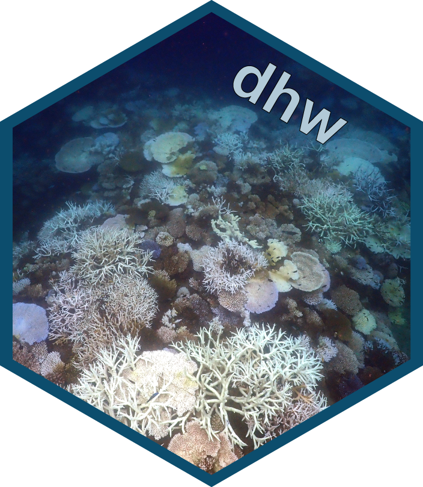

## dhw: an R package for calculating various SST metrics (Maximum Monthly Mean Climatology, SST Anomalies, Coral Bleaching HotSpots, Degree Heating Weeks) 


The <b>dhw</b> package calculates SST metrics from raw SST datasets by following the methods of the Coral Reef Watch Coral Bleaching Heat Stress Product Suite Version 3.1 (see Skirving et al. 2020 for methods).
<br>
<br>
The Degree Heating Weeks product from <a href="https://coralreefwatch.noaa.gov">National Oceanic and Atmospheric Administration’s (NOAA) Coral Reef Watch (CRW) program</a> is calculated from the 
<br>
<br>
Due to changes in the datasets used by the <a href="https://coralreefwatch.noaa.gov/product/5km/index_5km_sst.php">CRW</a> over the years (see Skirving et al. 2020 for details), the <a href="https://coralreefwatch.noaa.gov/product/5km/index_5km_sst.php">CoralTemp </a> degree heating weeks (and other SST metrics) are calculated against a specific climatology (1985–1990 and 1993) to allow for internally consistent anomaly products.
<br>
<br>
The <code>dhw</code> package provides a series of functions to recreate the algorithms for the CRW metrics (Maximum Monthly Mean Climatology, SST Anomalies, Coral Bleaching HotSpots, Degree Heating Weeks) using any SST product (e.g., <a href="https://www.ncei.noaa.gov/products/optimum-interpolation-sst">OISST</a>) that spans the baseline period of 1985 to 1993.
<br>
<br>
The package is uses the `terra` package to process the `raster` data and is (potentially) slower than other R packages (e.g. `stars`) and very much slower than other alternatives (e.g. `cdo`) for large datasets. Updated versions of the package will switch to `stars` spatiotemporal arrays and raster data cubes, and provide alternative functions for `cdo` to speed up large datasets.
<br>
<br>
Also included are a series of functions for visualising SST metrics and functions to reliably download common datasets (e.g. CRW, OISST) via the [NOAA NCEI thredds server](http://www.ncei.noaa.gov).  
<br>
<br>


Please file any [issues](https://github.com/marine-ecologist/dhw/issues) and comments and suggestions to [george.roff@csiro.au](mailto:george.roff@csiro.au).  

# Installation 


the current development version of `dhw` can be installed from github:

``` r
#install.packages("remotes")
devtools::install_github("https://github.com/marine-ecologist/dhw", force=TRUE)

```


# References 
Skirving <i>et al</i> (2020) Remote Sensing 12(3856) [doi:10.3390/rs12233856](https://www.mdpi.com/2072-4292/12/23/3856) 


