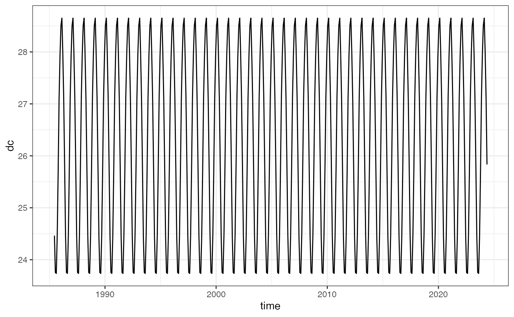

# Calculating Degree Heating Weeks

### Create Climatologies:

The main function ``` create_climatology(``) ``` takes an input
[`terra::rast()`](https://rspatial.github.io/terra/reference/rast.html)
SST file. Included is an example a subset of the NOAA CoralTemp for
Lizard Island (145.4, -14.7):

``` r
  library(dhw)
#>  library(dhw) dev v1.3.0
  library(terra)
#> terra 1.8.86
  library(ggplot2)
  library(tidyverse)
#> ── Attaching core tidyverse packages ──────────────────────── tidyverse 2.0.0 ──
#> ✔ dplyr     1.1.4     ✔ readr     2.1.6
#> ✔ forcats   1.0.1     ✔ stringr   1.6.0
#> ✔ lubridate 1.9.4     ✔ tibble    3.3.1
#> ✔ purrr     1.2.1     ✔ tidyr     1.3.2
#> ── Conflicts ────────────────────────────────────────── tidyverse_conflicts() ──
#> ✖ tidyr::extract() masks terra::extract()
#> ✖ dplyr::filter()  masks stats::filter()
#> ✖ dplyr::lag()     masks stats::lag()
#> ℹ Use the conflicted package (<http://conflicted.r-lib.org/>) to force all conflicts to become errors

  lizard_crw <- rast(system.file("extdata", "lizard_crw.tif", package="dhw"))
  
  lizard_crw
#> class       : SpatRaster 
#> size        : 1, 1, 14228  (nrow, ncol, nlyr)
#> resolution  : 0.05, 0.05  (x, y)
#> extent      : 145.4, 145.45, -14.7, -14.65  (xmin, xmax, ymin, ymax)
#> coord. ref. : lon/lat WGS 84 (EPSG:4326) 
#> source      : lizard_crw.tif 
#> names       :     analy~sst_1,     analy~sst_2,     analy~sst_3,     analy~sst_4,     analy~sst_5,     analy~sst_6,             ... 
#> min values  :           24.89,            25.2,           25.36,           25.27,           25.28,           24.75,             ... 
#> max values  :           24.89,            25.2,           25.36,           25.27,           25.28,           24.75,             ... 
#> unit        : degrees_Celsius 
#> time        : 1985-06-01 12:00:00 to 2024-05-15 12:00:00 UTC (14228 steps)
```

To create climatologies, use `create_climatology`:

``` r
  
  lizard_climatology <- create_climatology(lizard_crw)
#> --- create_climatology ---
#> 2.9e-06 secs  -  Processing Monthly Mean Climatology 
#> 2.3 secs  -  Processing Daily Climatology 
#> 2.5 secs  -  Processing SST Anomalies 
#> 3 secs  -  Processing HotSpots (HS) 
#> 3.4 secs  -  Processing Degree Heating Weeks (DHW) 
#> 3.7 secs  -  Combining outputs 
#> 3.8 secs  -  Writing files
```

which outputs a list of seven rasters, including sst (the original input
data), monthly maximum, mean monthly maximum, daily climatology,
anomalies, hotspots, and degree heating weeks:

``` r

str(lizard_climatology)
#> List of 7
#>  $ sst        :S4 class 'SpatRaster' [package "terra"]
#>  $ mm         :S4 class 'SpatRaster' [package "terra"]
#>  $ mmm        :S4 class 'SpatRaster' [package "terra"]
#>  $ climatology:S4 class 'SpatRaster' [package "terra"]
#>  $ anomaly    :S4 class 'SpatRaster' [package "terra"]
#>  $ hotspots   :S4 class 'SpatRaster' [package "terra"]
#>  $ dhw        :S4 class 'SpatRaster' [package "terra"]
```

### Details:

[`create_climatology()`](https://marine-ecologist.github.io/dhw/reference/create_climatology.md)
is a wrapper around the following functions:

- [`calculate_monthly_mean()`](https://marine-ecologist.github.io/dhw/reference/calculate_monthly_mean.md)
- [`calculate_maximum_monthly_mean()`](https://marine-ecologist.github.io/dhw/reference/calculate_maximum_monthly_mean.md)
- [`calculate_daily_climatology()`](https://marine-ecologist.github.io/dhw/reference/calculate_daily_climatology.md)
- [`calculate_hotspots()`](https://marine-ecologist.github.io/dhw/reference/calculate_hotspots.md)
- [`calculate_dhw()`](https://marine-ecologist.github.io/dhw/reference/calculate_dhw.md)

#### calculate monthly mean

the
[`calculate_monthly_mean()`](https://marine-ecologist.github.io/dhw/reference/calculate_monthly_mean.md)
function takes an input raster SST file (for example the `lizard_crw`
timeseries from above) and returns a the monthly means: mm-Jan through
to mm-Dec. Following the methodology of Skirving et al (2020):

> The monthly mean (MM) climatology is a set of 12 SST values that
> represent the average SST for each month calculated over the period
> 1985 to 2012, adjusted to 1988.2857 (being the average of the years
> used in the original climatology, i.e., 1985–1990 and 1993). To
> achieve this, the daily SST values in each month were averaged to
> produce 12 mean SST values for each of the 28 years from 1985 to 2012.
> A least squares linear regression was then applied to each month,
> e.g., the 28 values for each of the Januaries (Y-values) were
> regressed against the years (X-values), and the SST value
> corresponding to X= 1988.2857 was assigned as the MM value for January
> for each 0.05 × 0.05 degree pixel separately. This was repeated for
> each month until each pixel had a set of 12 MM values, representing
> the MM climatology. This method maintained a similar MM value to that
> of the original climatology while increasing the number of years that
> contributed to the climatology. This was done in order to provide
> consistency of interpretation throughout the various versions of the
> heat stress products

This function calculates the **monthly mean climatology (MM)** for a
given sea surface temperature (SST) dataset over a specified baseline
period (1985–2012). It first extracts the time dimension from the input
sst_file and filters the data to include only the years 1985–2012. For
each month (January to December), it subsets the SST data corresponding
to that month and applies a linear regression to estimate the SST value
adjusted to the year 1988.2857 (the average of the baseline years). This
is done by predicting the SST value for 1988.2857 using the regression
model. The function outputs a terra::rast object containing 12 layers,
one for each month’s climatological mean SST, with appropriate names and
metadata assigned to the layers.

``` r

lizard_crw_mm <- calculate_monthly_mean(sst_file = lizard_crw)

lizard_crw_mm
#> class       : SpatRaster 
#> size        : 1, 1, 12  (nrow, ncol, nlyr)
#> resolution  : 0.05, 0.05  (x, y)
#> extent      : 145.4, 145.45, -14.7, -14.65  (xmin, xmax, ymin, ymax)
#> coord. ref. : lon/lat WGS 84 (EPSG:4326) 
#> source(s)   : memory
#> varnames    : mm-Jan 
#>               mm-Feb 
#>               mm-Mar 
#>               ...
#> names       :   mm-Jan,   mm-Feb,   mm-Mar,   mm-Apr,   mm-May,   mm-Jun, ... 
#> min values  : 28.50679, 28.65061, 28.01818, 27.12108, 25.83351, 24.45509, ... 
#> max values  : 28.50679, 28.65061, 28.01818, 27.12108, 25.83351, 24.45509, ...
```

#### calculate maximum monthly mean

the
[`calculate_maximum_monthly_mean()`](https://marine-ecologist.github.io/dhw/reference/calculate_maximum_monthly_mean.md)
function takes the output from the monthly means above and returns a
single value, the maximum monthly mean. Following Skirving et al (2020):

> The Maximum Monthly Mean (MMM) climatology is the maximum of the 12 MM
> values for each satellite pixel.

``` r

lizard_crw_mmm <- calculate_maximum_monthly_mean(mm = lizard_crw_mm)

lizard_crw_mmm
#> class       : SpatRaster 
#> size        : 1, 1, 1  (nrow, ncol, nlyr)
#> resolution  : 0.05, 0.05  (x, y)
#> extent      : 145.4, 145.45, -14.7, -14.65  (xmin, xmax, ymin, ymax)
#> coord. ref. : lon/lat WGS 84 (EPSG:4326) 
#> source(s)   : memory
#> varname     : mmm_anom 
#> name        :      mmm 
#> min value   : 28.65061 
#> max value   : 28.65061
```

#### calculate daily climatology

the
[`calculate_daily_climatology()`](https://marine-ecologist.github.io/dhw/reference/calculate_daily_climatology.md)
function takes an input raster SST file in
[`terra::rast()`](https://rspatial.github.io/terra/reference/rast.html)
format. Following Skirving et al (2020):

> The daily climatologies (DC) are derived from the MM via a linear
> interpolation. To achieve this, the MM value was assigned to the 15th
> day of each corresponding month, with the individual days between
> these dates being derived using a linear interpolation. 

The function generates a **daily SST climatology** from a provided
monthly mean climatology (mm) and an SST dataset (sst_file). It first
ensures the time dimension of sst_file is in Date format and extracts
the start and end dates. Monthly time values are generated, and the
monthly climatology is repeated across the time range and assigned to
the 15th day of each month. Using zoo::na.approx, the function
interpolates the monthly climatology to a daily resolution, aligning it
with the exact daily dates of sst_file. The result is a terra::rast
object with daily climatology values, named and time-aligned to the
input SST dataset.

``` r

lizard_crw_climatology <- calculate_daily_climatology(sst_file = lizard_crw, mm = lizard_crw_mm)

lizard_crw_climatology
#> class       : SpatRaster 
#> size        : 1, 1, 14228  (nrow, ncol, nlyr)
#> resolution  : 0.05, 0.05  (x, y)
#> extent      : 145.4, 145.45, -14.7, -14.65  (xmin, xmax, ymin, ymax)
#> coord. ref. : lon/lat WGS 84 (EPSG:4326) 
#> source(s)   : memory
#> varname     : Daily SST climatology 
#> names       : 1985-06-01, 1985-06-02, 1985-06-03, 1985-06-04, 1985-06-05, 1985-06-06, ... 
#> min values  :   24.45509,   24.45509,   24.45509,   24.45509,   24.45509,   24.45509, ... 
#> max values  :   24.45509,   24.45509,   24.45509,   24.45509,   24.45509,   24.45509, ... 
#> time (days) : 1985-06-01 to 2024-05-15 (14228 steps)

lizard_crw_climatology |> as.data.frame(xy=TRUE, wide=FALSE, time=TRUE) |> rename(dc=values) |> 
ggplot() + theme_bw() + 
  geom_line(aes(time, dc))
```



#### calculate anomalies

the
[`calculate_anomalies()`](https://marine-ecologist.github.io/dhw/reference/calculate_anomalies.md)
function takes the sst file and the daily climatologies and calculates
the SST anomalies relative to the baseline period. Following the
methodology of Skirving et al 2020:

> The daily SST Anomaly product requires a daily climatology for
> calculating the daily SST anomalies. The daily SST Anomaly product is
> then calculated using
>
> \\ \text{SST Anomaly}\_i = \text{SST}\_i - \text{DC}\_d \\ where i is
> the day of the anomaly and d is the day number corresponding to i

The function subtracts the daily climatologies from the input sst_file
to give the daily anomalies.

``` r

lizard_crw_anomalies <- calculate_anomalies(sst_file = lizard_crw, climatology = lizard_crw_climatology)

lizard_crw_anomalies
#> class       : SpatRaster 
#> size        : 1, 1, 14228  (nrow, ncol, nlyr)
#> resolution  : 0.05, 0.05  (x, y)
#> extent      : 145.4, 145.45, -14.7, -14.65  (xmin, xmax, ymin, ymax)
#> coord. ref. : lon/lat WGS 84 (EPSG:4326) 
#> source(s)   : memory
#> varname     : SST Anomalies 
#> names       : 1985-06-01, 1985-06-02, 1985-06-03, 1985-06-04, 1985-06-05, 1985-06-06, ... 
#> min values  :  0.4349068,  0.7449082,  0.9049081,  0.8149079,  0.8249081,  0.2949074, ... 
#> max values  :  0.4349068,  0.7449082,  0.9049081,  0.8149079,  0.8249081,  0.2949074, ... 
#> time        : 1985-06-01 12:00:00 to 2024-05-15 12:00:00 UTC (14228 steps)
```

#### calculate hotspots

the
[`calculate_hotspots()`](https://marine-ecologist.github.io/dhw/reference/calculate_hotspots.md)
function takes the mean monthly maximum function and the initial SST
dataset and calculates the daily hotspots. Following Skirving et al
(2020):

> The HS is calculated as the difference between a day’s SST and the MMM:
>
> \\ \text HS_i = SST_i - MMM, \quad HS_i \geq 0 \\
>
> Note that there is only one value of the MMM for a single pixel,
> whereas the HS and corresponding SST vary on a daily basis. The HS is
> always zero or positive, so when the calculation results in a negative
> HS, it is set to zero.

the function computes **Coral Bleaching HotSpots (HS)** based on the
difference between sea surface temperature (SST) data (sst_file) and the
**Maximum Monthly Mean (MMM)** climatology (mmm). It begins by
calculating the anomaly (anomaly_mmm), which is the difference between
the SST and MMM. The anomalies are transformed into two hotspot rasters:
hotspots_unset, where values below 0 are set to 0, and hotspots, where
values below 1 are set to 0, reflecting the threshold for meaningful
heat stress. The function ensures that time metadata and proper variable
names are assigned to the resulting rasters, and the final raster
(hotspots) is returned, containing daily hotspot values for the SST data
aligned with the MMM climatology.

``` r

lizard_crw_hotspots <- calculate_hotspots(mmm = lizard_crw_mmm, sst_file = lizard_crw)

lizard_crw_hotspots
#> class       : SpatRaster 
#> size        : 1, 1, 14228  (nrow, ncol, nlyr)
#> resolution  : 0.05, 0.05  (x, y)
#> extent      : 145.4, 145.45, -14.7, -14.65  (xmin, xmax, ymin, ymax)
#> coord. ref. : lon/lat WGS 84 (EPSG:4326) 
#> source(s)   : memory
#> varname     : Hotspots 
#> names       : 1985-06-01, 1985-06-02, 1985-06-03, 1985-06-04, 1985-06-05, 1985-06-06, ... 
#> min values  :          0,          0,          0,          0,          0,          0, ... 
#> max values  :          0,          0,          0,          0,          0,          0, ... 
#> time (days) : 1985-06-01 to 2024-05-15 (14228 steps)
```

#### calculate degree heating weeks

the
[`calculate_dhw()`](https://marine-ecologist.github.io/dhw/reference/calculate_dhw.md)
function takes the hotspots and a specified window (by default 84 days,
12 weeks). Following Skirving et al (2020):

> The DHW is the daily summation, over a 12-week (84 days) running
> window, of HS values of 1 or more, expressed as degrees Celsius weeks
> (◦C weeks), since the development of coral bleaching is usually on the
> order of weeks. Each daily HS value, if included in the summation, is
> divided by seven prior to being added to the total, such that
>
> \\ \text{DHW}\_i = \sum\_{n = i-83}^{i} \left( \frac{\text{HS}\_n}{7}
> \right), \quad \text{where } \text{HS}\_n \geq 1 \\
>
> For example, if the 12-week window ending on June 1, 2014 (i= 1 June
> 2014), had included only four daily Coral Bleaching HotSpot values
> above zero, of 1.0, 2.0, 0.8 and 1.2◦C, then, since 0.8◦C is less than
> 1◦C, it would not be included in the DHW summation of accumulated heat
> stress for this period. However, 1.0, 2.0, and 1.2◦C each would have
> been divided by seven, and then summed. The resulting DHW value for 1
> June 2014 (DHW1 June 2014) would have been 0.6◦C weeks.

The function computes the Degree Heating Weeks (DHW) metric, which
accumulates heat stress over a specified rolling window (defaulting to
84 days). The function operates by applying a rolling sum on the input
hotspots raster data. For each pixel, if the daily hotspot values are
greater than or equal to 1, they are summed over the rolling window and
divided by 7 to calculate weekly averages using zoo::rollapply. The
function returns a raster object with the calculated DHW values, which
represent accumulated heat stress.

``` r

lizard_crw_dhw <- calculate_dhw(lizard_crw_hotspots)

lizard_crw_dhw
#> class       : SpatRaster 
#> size        : 1, 1, 14228  (nrow, ncol, nlyr)
#> resolution  : 0.05, 0.05  (x, y)
#> extent      : 145.4, 145.45, -14.7, -14.65  (xmin, xmax, ymin, ymax)
#> coord. ref. : lon/lat WGS 84 (EPSG:4326) 
#> source(s)   : memory
#> varname     : Degree Heating Weeks 
#> names       : 1985-06-01, 1985-06-02, 1985-06-03, 1985-06-04, 1985-06-05, 1985-06-06, ... 
#> min values  :        NaN,        NaN,        NaN,        NaN,        NaN,        NaN, ... 
#> max values  :        NaN,        NaN,        NaN,        NaN,        NaN,        NaN, ... 
#> time (days) : 1985-06-01 to 2024-05-15 (14228 steps)
```
