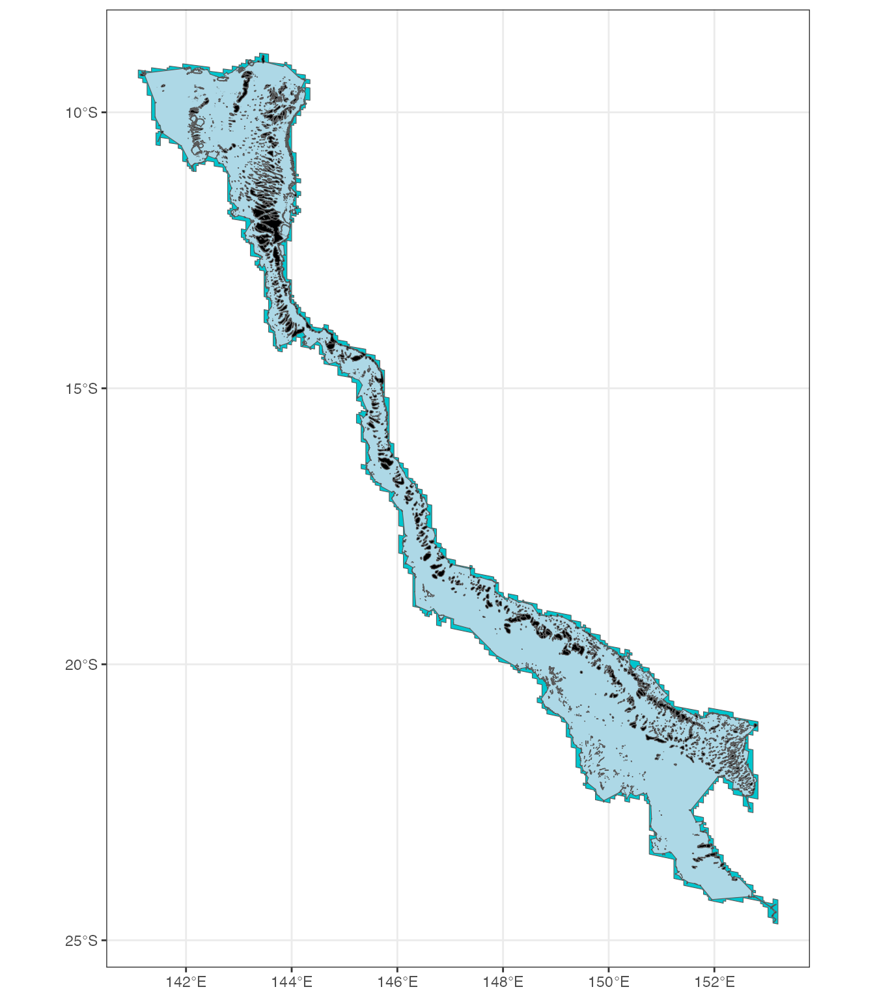

# Extracting SST and spatial data

``` r
library(dhw)
#>  library(dhw) dev v1.3.0
library(sf)
#> Linking to GEOS 3.13.0, GDAL 3.8.5, PROJ 9.5.1; sf_use_s2() is TRUE
library(tidyverse)
#> ── Attaching core tidyverse packages ──────────────────────── tidyverse 2.0.0 ──
#> ✔ dplyr     1.1.4     ✔ readr     2.1.6
#> ✔ forcats   1.0.1     ✔ stringr   1.6.0
#> ✔ ggplot2   4.0.1     ✔ tibble    3.3.1
#> ✔ lubridate 1.9.4     ✔ tidyr     1.3.2
#> ✔ purrr     1.2.1
#> ── Conflicts ────────────────────────────────────────── tidyverse_conflicts() ──
#> ✖ dplyr::filter() masks stats::filter()
#> ✖ dplyr::lag()    masks stats::lag()
#> ℹ Use the conflicted package (<http://conflicted.r-lib.org/>) to force all conflicts to become errors
library(terra)
#> terra 1.8.86
#> 
#> Attaching package: 'terra'
#> 
#> The following object is masked from 'package:tidyr':
#> 
#>     extract
```

### Extract GBR spatial data

Use this function to download the GBR Reefs dataset via eAtlas. Several
versions of the GBRMPA shp file exist, this version from eAtlas include
the Torres Straits:

> This dataset consists of a shapefile of the reefs, islands, sand
> banks, cays and rocks of the whole Great Barrier Reef (GBR) including
> Torres Strait. This dataset is an extension of the mapping in the GBR
> Marine Park to include Torres Strait. The Torres Strait region was
> mapped at a scale of 1:50,000 (Lawrey, E. P., Stewart M., 2016) and
> these new features are referred to as the “Torres Strait Reef and
> Island Features” dataset. The Complete GBR Reef and Island Features
> dataset integrates the “Torres Strait Reef and Island Features”
> dataset with the existing “GBR Features” (Great Barrier Reef Marine
> Park Authority, 2007) to create a single composite dataset of the
> whole Great Barrier Reef.

for metadata see here:

[Complete Great Barrier Reef (GBR) Island and Reef Feature boundaries
including Torres Strait Version 1b (NESP TWQ 3.13, AIMS, TSRA,
GBRMPA)](https://researchdata.edu.au/complete-great-barrier-tsra-gbrmpa/675397)

The function returns either “hull” (convex hull around reefs), “base”
(basic with no changes), or “combined” (polygons merged to reef ID)

``` r

#gbr_reefs <- download_gbr_spatial(return="combined")
gbr_reefs <- download_gbr_spatial(return="base")
#> Downloading spatial data...
#> Reading and transforming shapefile...

gbr_reefs
#> Simple feature collection with 9612 features and 35 fields
#> Geometry type: POLYGON
#> Dimension:     XY
#> Bounding box:  xmin: 138.0012 ymin: -29.17855 xmax: 153.5516 ymax: -8.679173
#> Geodetic CRS:  GDA94
#> First 10 features:
#>    TARGET_FID     DATASET               LOC_NAME_S      GBR_NAME CHART_NAME
#> 1           1 TS Features  U/N Sand Bank (09-347a) U/N Sand Bank       <NA>
#> 2           2 TS Features   U/N Sand Bank (09-347) U/N Sand Bank       <NA>
#> 3           3 TS Features  U/N Sand Bank (09-355z) U/N Sand Bank       <NA>
#> 4           4 TS Features U/N Sand Bank (09-355a0) U/N Sand Bank       <NA>
#> 5           5 TS Features U/N Sand Bank (09-355a1) U/N Sand Bank       <NA>
#> 6           6 TS Features  U/N Sand Bank (09-355v) U/N Sand Bank       <NA>
#> 7           7 TS Features  U/N Sand Bank (09-355x) U/N Sand Bank       <NA>
#> 8           8 TS Features  U/N Sand Bank (09-355y) U/N Sand Bank       <NA>
#> 9           9 TS Features  U/N Sand Bank (09-355w) U/N Sand Bank       <NA>
#> 10         10 TS Features   U/N Sand Bank (09-373) U/N Sand Bank       <NA>
#>    TRAD_NAME UN_FEATURE LABEL_ID SORT_GBR_I FEAT_NAME LEVEL_1   LEVEL_2
#> 1       <NA>       TRUE  09-347a       9347      Bank    Bank Sand Bank
#> 2       <NA>       TRUE   09-347       9347      Bank    Bank Sand Bank
#> 3       <NA>       TRUE  09-355z       9355      Bank    Bank Sand Bank
#> 4       <NA>       TRUE 09-355a0       9355      Bank    Bank Sand Bank
#> 5       <NA>       TRUE 09-355a1       9355      Bank    Bank Sand Bank
#> 6       <NA>       TRUE  09-355v       9355      Bank    Bank Sand Bank
#> 7       <NA>       TRUE  09-355x       9355      Bank    Bank Sand Bank
#> 8       <NA>       TRUE  09-355y       9355      Bank    Bank Sand Bank
#> 9       <NA>       TRUE  09-355w       9355      Bank    Bank Sand Bank
#> 10      <NA>       TRUE   09-373       9373      Bank    Bank Sand Bank
#>      LEVEL_3 CLASS_CONF CLASS_SRC POLY_ORIG IMG_SRC SUB_NO           CODE
#> 1  Sand Bank       High   Landsat       New Landsat    101 09-347-110-101
#> 2  Sand Bank       High   Landsat       New Landsat    100 09-347-110-100
#> 3  Sand Bank       High   Landsat       New Landsat    126 09-355-110-126
#> 4  Sand Bank       High   Landsat       New Landsat    127 09-355-110-127
#> 5  Sand Bank       High   Landsat       New Landsat    128 09-355-110-128
#> 6  Sand Bank       High   Landsat       New Landsat    122 09-355-110-122
#> 7  Sand Bank       High   Landsat       New Landsat    124 09-355-110-124
#> 8  Sand Bank       High   Landsat       New Landsat    125 09-355-110-125
#> 9  Sand Bank       High   Landsat       New Landsat    123 09-355-110-123
#> 10 Sand Bank       High   Landsat       New Landsat    100 09-373-110-100
#>    FEATURE_C      QLD_NAME X_LABEL GBR_ID LOC_NAME_L  X_COORD   Y_COORD
#> 1        110 U/N Sand Bank    <NA>   <NA>       <NA> 143.0781 -9.270715
#> 2        110 U/N Sand Bank    <NA>   <NA>       <NA> 143.0429 -9.293290
#> 3        110 U/N Sand Bank    <NA>   <NA>       <NA> 143.1020 -9.388480
#> 4        110 U/N Sand Bank    <NA>   <NA>       <NA> 143.0973 -9.388562
#> 5        110 U/N Sand Bank    <NA>   <NA>       <NA> 143.0940 -9.390258
#> 6        110 U/N Sand Bank    <NA>   <NA>       <NA> 143.1209 -9.386653
#> 7        110 U/N Sand Bank    <NA>   <NA>       <NA> 143.0837 -9.393855
#> 8        110 U/N Sand Bank    <NA>   <NA>       <NA> 143.1636 -9.405083
#> 9        110 U/N Sand Bank    <NA>   <NA>       <NA> 143.0506 -9.404345
#> 10       110 U/N Sand Bank    <NA>   <NA>       <NA> 142.9252 -9.756551
#>    SHAPE_AREA  SHAPE_LEN Checked RegionID LatitudeID GroupID PriorityLb
#> 1  0.78616854 10.4794306   FALSE       13          9     347      FALSE
#> 2  2.95336187 17.8452808   FALSE       13          9     347       TRUE
#> 3  0.17314345  2.0730203   FALSE       13          9     355      FALSE
#> 4  0.05753826  1.0656155   FALSE       13          9     355      FALSE
#> 5  0.03254316  0.7397521   FALSE       13          9     355      FALSE
#> 6  3.57375838 16.4615152   FALSE       13          9     355      FALSE
#> 7  0.88188514  7.8675980   FALSE       13          9     355      FALSE
#> 8  0.32171390  2.9717605   FALSE       13          9     355      FALSE
#> 9  1.52979291 14.3151950   FALSE       13          9     355      FALSE
#> 10 1.65930929  9.6393642   FALSE       14          9     373       TRUE
#>             Country   UNIQUE_ID                       geometry
#> 1  Papua-New Guinea 09347110101 POLYGON ((143.0851 -9.26657...
#> 2  Papua-New Guinea 09347110100 POLYGON ((143.0549 -9.29339...
#> 3  Papua-New Guinea 09355110126 POLYGON ((143.1056 -9.3908,...
#> 4  Papua-New Guinea 09355110127 POLYGON ((143.0985 -9.39007...
#> 5  Papua-New Guinea 09355110128 POLYGON ((143.0939 -9.39146...
#> 6  Papua-New Guinea 09355110122 POLYGON ((143.1298 -9.36866...
#> 7  Papua-New Guinea 09355110124 POLYGON ((143.0905 -9.38934...
#> 8  Papua-New Guinea 09355110125 POLYGON ((143.1675 -9.40401...
#> 9  Papua-New Guinea 09355110123 POLYGON ((143.0739 -9.39021...
#> 10        Australia 09373110100 POLYGON ((142.9353 -9.77388...

GBR_hull <- download_gbr_spatial(return="hull", crs = "EPSG:7844")
#> Downloading spatial data...
#> Reading and transforming shapefile...
```

Set up a boundary to mask the raster data by buffering a 1km concave
hull surrounding the GBR Reefs:

``` r

gbr_reefs_border <- gbr_reefs |> 
  st_make_valid() |> 
  dplyr::filter(FEAT_NAME %in% c("Reef", "Terrestrial Reef")) 

gbr_reefs_hull <- gbr_reefs_border |> 
  concaveman::concaveman() |> 
  st_make_valid()

gbr_reefs_hull_buffered <- gbr_reefs_hull |> 
  st_buffer(1000) 

ggplot() + theme_bw() +
  geom_sf(data=gbr_reefs_hull_buffered,  fill="turquoise3") +
  geom_sf(data=gbr_reefs_hull, fill="lightblue") +
  geom_sf(data=gbr_reefs_border, fill="black") 
```



### Downloading and extracting SST data

NOAA provide many options for downloading SST data.
[ERDAPP](https://www.ncei.noaa.gov/erddap/) via the `rerdapp` library is
very useful for smaller requests, but (in my experience) downloading
long-time series or large spatial extents of data can result in
signficant timeouts.

Below are three helper functions that directly download CRW, OISST, and
ERA5 datasets at global scales:

#### Extract NOAA CoralTemp spatial data

[`download_CoralTemp()`](https://marine-ecologist.github.io/dhw/reference/download_CoralTemp.md)
pulls global data from the `ncei` https as follows:

``` r


download_CoralTemp(url = "https://www.ncei.noaa.gov/thredds-ocean/fileServer/crw/5km/v3.1/nc/v1.0/daily/",
                   start_date = "2025-01-01",
                   end_date = "2025-03-31",
                   dest_dir = "/Volumes/Extreme_SSD/dhw/CRW/CRW_SST/",
                   variable = "sst",
                   mc.cores = 10)

download_CoralTemp(url = "https://www.ncei.noaa.gov/thredds-ocean/fileServer/crw/5km/v3.1/nc/v1.0/daily/",
                   start_date = "2025-01-01",
                   end_date = "2025-03-31",
                   dest_dir = "/Volumes/Extreme_SSD/dhw/CRW/CRW_SSTA/",
                   variable = "ssta",
                   quiet = FALSE,
                   mc.cores = 10)

download_CoralTemp(url = "https://www.ncei.noaa.gov/thredds-ocean/fileServer/crw/5km/v3.1/nc/v1.0/daily/",
                   start_date = "2025-01-01",
                   end_date = "2025-03-31",
                   dest_dir = "/Volumes/Extreme_SSD/dhw/CRW/CRW_HS/",
                   variable = "hs",
                   mc.cores = 10)

download_CoralTemp(url = "https://www.ncei.noaa.gov/thredds-ocean/fileServer/crw/5km/v3.1/nc/v1.0/daily/",
                   start_date = "2025-01-01",
                   end_date = "2025-03-31",
                   dest_dir = "/Volumes/Extreme_SSD/dhw/CRW/CRW_DHW/",
                   variable = "dhw",
                   quiet = FALSE,
                   mc.cores = 10)
```

the full global dataset for four variables (sst, ssta, hs, dhw) is
520.78GB in individual ~10-11MB .nc files.

`process_CoralTemp` does three functions: 1) crop-mask to a polygon
shape (here the GBR hull), 2) combine `rast` files using
[`c()`](https://rdrr.io/r/base/c.html), 3) output to an `.rds` file for
saving. The function will be paralellised (later) as it is *slow*

``` r

process_CoralTemp(input = "/Volumes/Extreme_SSD/dhw/CRW/CRW_SST",
                  polygon = GBR_hull, crs = "EPSG:7844",
                  combinedfilename = "/Volumes/Extreme_SSD/dhw/summaries/GBR_CoralTemp_full.rds",
                  crop=TRUE, mask=TRUE, downsample=FALSE)

GBR_CoralTemp_full <- readRDS( "/Volumes/Extreme_SSD/dhw/summaries/GBR_CoralTemp_full.rds")


process_CoralTemp(input = "/Volumes/Extreme_SSD/dhw/CRW/CRW_DHW",
                  polygon = GBR_hull, crs = "EPSG:7844",
                  combinedfilename = "/Volumes/Extreme_SSD/dhw/summaries/GBR_CoralTemp_DHW_full.rds",
                  crop=TRUE, mask=TRUE, downsample=FALSE, mc.cores = 10)
```

Alternatively, `cdo` offers a much faster workflow using
`cdo mergetime *.nc outfile` and cropped to the GBR extent
using`remapbil,target_grid_file.nc input.nc regridded_output.nc` (note:
CDO does not directly support cropping to irregular polygons, so
remapbil sets to the extent (bbox).

#### Extract OISST

[`download_OISST()`](https://marine-ecologist.github.io/dhw/reference/download_OISST.md)
pulls global data from the `ncei` https as follows:

``` r

download_OISST(url = "https://www.ncei.noaa.gov/data/sea-surface-temperature-optimum-interpolation/v2.1/access/avhrr/",
               start_date = "2025-03-18",
               end_date = "2025-03-31",
               dest_dir = "/Volumes/Extreme_SSD/dhw/OISST/2025/",
               mc.cores = 10)
```

the full global dataset is 26.39GB in individual ~10-11MB .nc files.

`process_OISST` does three functions: 1) crop-mask to a polygon shape
(here the GBR hull), 2) combine `rast` files using
[`c()`](https://rdrr.io/r/base/c.html), 3) output to an `.rds` file for
saving. ~~The function will be paralellised (later) as it is *slow*~~
**Update (**2/4/25) to run with
[`parallel::mclapply()`](https://rdrr.io/r/parallel/mclapply.html) if
`mc.cores >1` - processing 15918 files across 10 cores now takes 88
seconds

``` r

process_OISST(input = "/Volumes/Extreme_SSD/dhw/OISST/",
              polygon = GBR_hull, crs = "EPSG:7844",
              combinedfilename = "/Volumes/Extreme_SSD/dhw/summaries/GBR_OISST_2025.rds",
              crop=TRUE, mask=TRUE, downsample=FALSE, mc.cores=10)

terra::rast("/Volumes/Extreme_SSD/dhw/summaries/GBR_OISST_full_2025.rds")
  
```

Alternatively, `cdo` offers a much faster workflow using
`cdo mergetime *.nc outfile` and cropped to the GBR extent
using`remapbil,target_grid_file.nc input.nc regridded_output.nc` (note:
CDO does not directly support cropping to irregular polygons, so
remapbil sets to the extent (bbox).

#### Extract ERA5

ERA5 doesn’t have a direct `https` link as far as I’m aware. The
[`download_ERA5()`](https://marine-ecologist.github.io/dhw/reference/download_ERA5.md)
function uses the `ecmwfr` interface to ‘ECMWF’ and ‘CDS’ Data Web
Services to access the daily SST data via
[Copernicus](https://cds.climate.copernicus.eu/datasets/reanalysis-era5-single-levels).
Once downloaded, the
[`process_ERA5()`](https://marine-ecologist.github.io/dhw/reference/process_ERA5.md)
function combines the outputs to a single `rast` file.

``` r

download_ERA5(
    start_year = 1940,
    end_year = 2025,
    ecmwfr_key = "381246a1-68c9-4e99-aab2-44c36d6da73d",
    timeout=60,
    dest_dir = "/Volumes/Extreme_SSD/dhw/ERA5/"
  )
  
  


process_ERA5(input = "/Volumes/Extreme_SSD/dhw/ERA5/", units = "celsius",
              polygon = GBR_hull, crs = "EPSG:7844",
              combinedfilename = "/Volumes/Extreme_SSD/dhw/summaries/GBR_ERA5_full.rds",
              crop=TRUE, mask=TRUE, downsample=FALSE)
terra::rast("/Volumes/Extreme_SSD/dhw/summaries/GBR_ERA5_full.rds")
```
