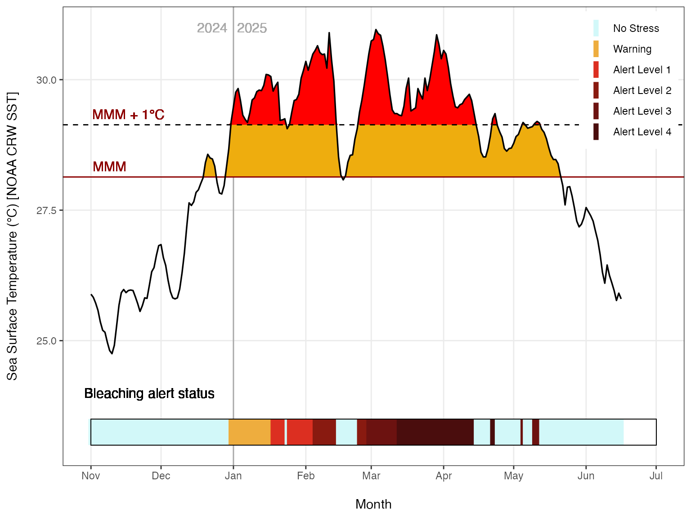
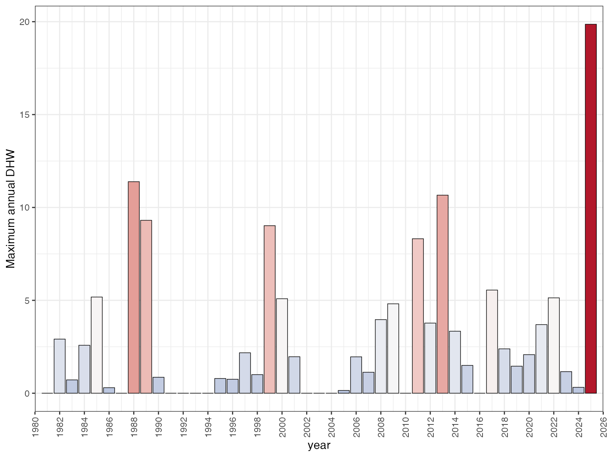
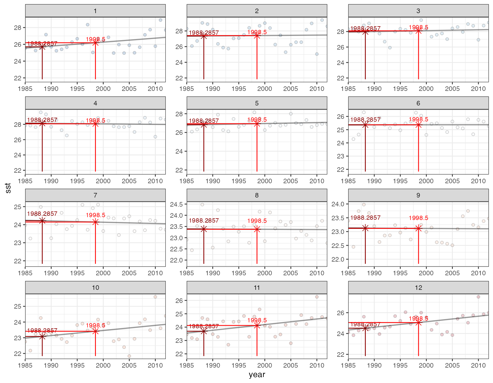

# Visualising DHW outputs

`dhw` has several built-in functions for visualising timeseries outputs.

Example outputs from Ningaloo Reef data:

``` r
library(terra)
library(tidyverse)
library(dhw)
library(sf)
library(tmap)
library(rnaturalearth)
library(patchwork)


# read raster from package, calculate climatology
ningaloo_OISST <- rast(system.file("extdata", "ningaloo_OISST.tif", package = "dhw", mustWork = TRUE))
all_climatology <- create_climatology(ningaloo_OISST, baa = TRUE, quiet=TRUE)

# Example site at Ningaloo for timeseries:
ningaloo_pt <- st_point(c(113.926, -21.92)) |>
  st_sfc(crs = 4326) |>
  st_transform(terra::crs(ningaloo_OISST)) |>
  st_buffer(0.01)

ningaloo_slope_OISST <- crop(ningaloo_OISST, vect(ningaloo_pt))
ningaloo_climatology <- create_climatology(ningaloo_slope_OISST, baa = TRUE, quiet=TRUE)
```

## Timeseries plots

#### Plot maximum annual DHW:

plot a `NOAA`esque annual time-series of sst with Mean Monthly Maximum
and Bleaching Alert Levels from the main climatology input:

``` r
plot_sst_timeseries(ningaloo_climatology, 2025)
```



#### Plot maximum annual DHW:

Plot maximum annual DHW from `spatraster` input:

``` r
plot_max_dhw(ningaloo_climatology$dhw)
```



#### Plot annual DHW timeseries:

Plot annual DHW timeseries from `spatraster` input:

``` r
plot_annual_dhw(ningaloo_climatology$dhw)
```


#### Plot mean monthly SST:

Plot mean monthly SST for a lon/lat from an input sst `spatraster`:

``` r
plot_mm(ningaloo_climatology$sst, lon=113.8, lat=-21.9)
```



## Spatial maps

Spatial maps of DHW for select dates:

``` r
# extract dates from climatology
dates <- c("2011-03-31", "2024-03-22", "2025-04-04")
idx <- match(dates, names(all_climatology$dhw))
ningaloo_subset <- all_climatology$dhw[[idx[!is.na(idx)]]]


# get rNaturalEarth data
aus <- rnaturalearth::ne_countries(country="Australia", scale=10)

# map with tmap
tm_basemap("Esri.WorldImagery", alpha=0.4) +
tm_shape(aus, bbox=st_bbox(ningaloo_subset)) + 
  tm_lines() +
tm_shape(ningaloo_subset, bbox=st_bbox(ningaloo_subset)) +
  tm_raster(col_alpha = 0.5,
            col.scale = tm_scale_continuous(limits=c(0,26), values="-brewer.spectral"), 
            col.free=FALSE,
            col.legend = tm_legend(title="DHW", orientation = "landscape")) 
```


